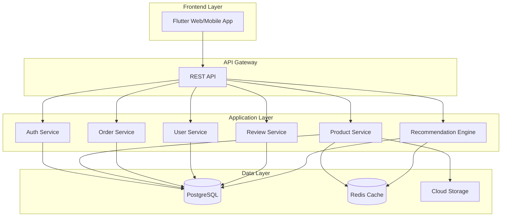

# Designdokument - E-handelsplattform

## Översikt

Detta dokument beskriver den tekniska designen för en modern e-handelsplattform inspirerad av Temu. Plattformen kommer att byggas med fokus på prestanda, skalbarhet och användarupplevelse. Designen följer en modern arkitektur med separation mellan frontend och backend, vilket möjliggör flexibilitet och enkel underhåll.

### Teknisk Stack

**Frontend:**
- Flutter Web/Mobile - för responsiv design över alla plattformar
- State Management: Provider eller Riverpod
- HTTP Client: Dio för API-kommunikation
- Caching: Hive för lokal datalagring

**Backend:**
- Node.js med Express eller NestJS
- PostgreSQL för relationell data
- Redis för caching och sessionshantering
- JWT för autentisering

**Infrastruktur:**
- CDN för bildoptimering och snabb leverans
- Cloud storage för produktbilder
- Load balancer för skalbarhet

## Arkitektur

### Systemarkitektur



### Lagerseparation

**Presentation Layer (Flutter):**
- UI Components
- State Management
- Routing och Navigation
- Lokal caching

**Business Logic Layer (Backend Services):**
- Affärslogik och validering
- Databearbetning
- Integration med externa tjänster
- Rekommendationsalgoritmer

**Data Access Layer:**
- Repository pattern för dataåtkomst
- ORM för databasoperationer
- Caching-strategier

## Komponenter och Gränssnitt

### Frontend-komponenter

#### 1. HomePage Component
**Ansvar:** Visa dynamisk startsida med kampanjer och rekommendationer

**Gränssnitt:**
```dart
class HomePage extends StatefulWidget {
  @override
  _HomePageState createState() => _HomePageState();
}

class _HomePageState extends State<HomePage> {
  Future<void> loadHomeData();
  Widget buildCampaignCarousel();
  Widget buildCategorySection();
  Widget buildRecommendations();
  Widget buildFlashSaleTimer();
}
```

#### 2. ProductSearch Component
**Ansvar:** Hantera sökning och filtrering av produkter

**Gränssnitt:**
```dart
class ProductSearchPage extends StatefulWidget {
  @override
  _ProductSearchPageState createState() => _ProductSearchPageState();
}

class _ProductSearchPageState extends State<ProductSearchPage> {
  Future<List<Product>> searchProducts(String query);
  void applyFilters(FilterOptions filters);
  void sortProducts(SortOption option);
  Widget buildSearchSuggestions();
}
```

#### 3. ProductDetail Component
**Ansvar:** Visa detaljerad produktinformation

**Gränssnitt:**
```dart
class ProductDetailPage extends StatefulWidget {
  final String productId;
  
  @override
  _ProductDetailPageState createState() => _ProductDetailPageState();
}

class _ProductDetailPageState extends State<ProductDetailPage> {
  Future<Product> loadProductDetails();
  Widget buildImageGallery();
  Widget buildReviews();
  Widget buildRelatedProducts();
  void addToCart();
  void addToWishlist();
}
```

#### 4. ShoppingCart Component
**Ansvar:** Hantera varukorg och beräkningar

**Gränssnitt:**
```dart
class ShoppingCartPage extends StatefulWidget {
  @override
  _ShoppingCartPageState createState() => _ShoppingCartPageState();
}

class _ShoppingCartPageState extends State<ShoppingCartPage> {
  void updateQuantity(String productId, int quantity);
  void removeItem(String productId);
  void applyCoupon(String code);
  double calculateTotal();
  Widget buildCartItems();
}
```

#### 5. Checkout Component
**Ansvar:** Hantera betalningsprocessen

**Gränssnitt:**
```dart
class CheckoutPage extends StatefulWidget {
  @override
  _CheckoutPageState createState() => _CheckoutPageState();
}

class _CheckoutPageState extends State<CheckoutPage> {
  Future<void> submitOrder();
  void selectShippingMethod();
  void selectPaymentMethod();
  Widget buildAddressForm();
  Widget buildPaymentForm();
}
```

### Backend API-endpoints

#### Product Service
```
GET    /api/products              - Hämta produktlista
GET    /api/products/:id          - Hämta produktdetaljer
POST   /api/products/search       - Sök produkter
GET    /api/products/categories   - Hämta kategorier
GET    /api/products/flash-sales  - Hämta flash-reor
```

#### Cart Service
```
GET    /api/cart                  - Hämta varukorg
POST   /api/cart/items            - Lägg till i varukorg
PUT    /api/cart/items/:id        - Uppdatera antal
DELETE /api/cart/items/:id        - Ta bort från varukorg
POST   /api/cart/coupon           - Applicera kupong
```

#### Order Service
```
POST   /api/orders                - Skapa beställning
GET    /api/orders                - Hämta beställningar
GET    /api/orders/:id            - Hämta beställningsdetaljer
PUT    /api/orders/:id/status     - Uppdatera status
```

#### User Service
```
POST   /api/auth/register         - Registrera användare
POST   /api/auth/login            - Logga in
GET    /api/users/profile         - Hämta profil
PUT    /api/users/profile         - Uppdatera profil
GET    /api/users/wishlist        - Hämta önskelista
POST   /api/users/wishlist        - Lägg till i önskelista
```

#### Review Service
```
POST   /api/reviews               - Skapa recension
GET    /api/reviews/product/:id   - Hämta recensioner
PUT    /api/reviews/:id           - Uppdatera recension
```

#### Admin Service
```
POST   /api/admin/products        - Skapa produkt
PUT    /api/admin/products/:id    - Uppdatera produkt
DELETE /api/admin/products/:id    - Ta bort produkt
POST   /api/admin/flash-sales     - Skapa flash-rea
GET    /api/admin/orders          - Hämta alla beställningar
POST   /api/admin/coupons         - Skapa kupong
```

## Datamodeller

### Product
```typescript
interface Product {
  id: string;
  name: string;
  description: string;
  price: number;
  originalPrice: number;
  discount: number;
  category: string;
  images: string[];
  specifications: Record<string, string>;
  stock: number;
  rating: number;
  reviewCount: number;
  createdAt: Date;
  updatedAt: Date;
}
```

### User
```typescript
interface User {
  id: string;
  email: string;
  passwordHash: string;
  firstName: string;
  lastName: string;
  phone: string;
  addresses: Address[];
  wishlist: string[]; // Product IDs
  createdAt: Date;
  updatedAt: Date;
}

interface Address {
  id: string;
  street: string;
  city: string;
  postalCode: string;
  country: string;
  isDefault: boolean;
}
```

### Cart
```typescript
interface Cart {
  id: string;
  userId: string;
  items: CartItem[];
  couponCode?: string;
  discount: number;
  subtotal: number;
  total: number;
  updatedAt: Date;
}

interface CartItem {
  productId: string;
  quantity: number;
  price: number;
}
```

### Order
```typescript
interface Order {
  id: string;
  orderNumber: string;
  userId: string;
  items: OrderItem[];
  shippingAddress: Address;
  paymentMethod: string;
  subtotal: number;
  discount: number;
  shippingCost: number;
  total: number;
  status: OrderStatus;
  trackingNumber?: string;
  createdAt: Date;
  updatedAt: Date;
}

interface OrderItem {
  productId: string;
  productName: string;
  quantity: number;
  price: number;
}

enum OrderStatus {
  PENDING = 'pending',
  CONFIRMED = 'confirmed',
  PROCESSING = 'processing',
  SHIPPED = 'shipped',
  DELIVERED = 'delivered',
  CANCELLED = 'cancelled'
}
```

### Review
```typescript
interface Review {
  id: string;
  productId: string;
  userId: string;
  userName: string;
  rating: number; // 1-5
  comment: string;
  images: string[];
  helpful: number;
  createdAt: Date;
}
```

### FlashSale
```typescript
interface FlashSale {
  id: string;
  name: string;
  productIds: string[];
  discount: number;
  startTime: Date;
  endTime: Date;
  isActive: boolean;
}
```

### Coupon
```typescript
interface Coupon {
  id: string;
  code: string;
  discount: number;
  discountType: 'percentage' | 'fixed';
  minPurchase: number;
  maxDiscount?: number;
  validFrom: Date;
  validUntil: Date;
  usageLimit: number;
  usedCount: number;
  isActive: boolean;
}
```

## Korrekthetsegenskaper

*En egenskap är en karakteristik eller beteende som ska gälla för alla giltiga exekveringar av ett system - i grund och botten ett formellt påstående om vad systemet ska göra. Egenskaper fungerar som bryggan mellan läsbara specifikationer och maskinverifierbara korrekthetsgarantier.*


### Egenskap 1: Produktrendering innehåller alla obligatoriska element
*För alla* produkter som visas på startsidan ska renderingen innehålla produktbild, pris, originalspris med genomstruken text och rabatt i procent.
**Validerar: Krav 1.4**

### Egenskap 2: Personliga rekommendationer baseras på användarhistorik
*För alla* inloggade användare ska rekommendationsmotorn returnera produkter som är relevanta baserat på användarens tidigare beteende.
**Validerar: Krav 1.3**

### Egenskap 3: Sökförslag returneras för alla söktermer
*För alla* söktermer ska systemet returnera relevanta sökförslag i realtid.
**Validerar: Krav 2.1**

### Egenskap 4: Sökresultat matchar söktermen
*För alla* söktermer ska alla returnerade produkter matcha söktermen på något sätt (namn, beskrivning, kategori).
**Validerar: Krav 2.2**

### Egenskap 5: Filter uppdaterar produktlistan korrekt
*För alla* filteralternativ ska produktlistan uppdateras så att endast produkter som matchar filtret visas.
**Validerar: Krav 2.4**

### Egenskap 6: Sortering ordnar produkter korrekt
*För alla* sorteringsalternativ (pris låg-hög, pris hög-låg, popularitet, nyast) ska produkterna vara korrekt sorterade enligt valt kriterium.
**Validerar: Krav 2.5**

### Egenskap 7: Produktsida visar all obligatorisk information
*För alla* produkter ska produktsidan visa produktnamn, aktuellt pris, originalspris, rabatt, beskrivning och specifikationer.
**Validerar: Krav 3.2**

### Egenskap 8: Rekommendationsmotor returnerar relevanta produkter
*För alla* produkter ska systemet visa liknande produkter och "Köptes ofta tillsammans"-förslag som är relevanta.
**Validerar: Krav 3.4**

### Egenskap 9: Lägg till i varukorg ökar antalet korrekt
*För alla* produkter ska klick på "Lägg till i varukorg" resultera i att produkten läggs till och varukorgsikonen uppdateras med korrekt antal.
**Validerar: Krav 4.1, 4.2**

### Egenskap 10: Varukorg visar all produktinformation
*För alla* produkter i varukorgen ska renderingen innehålla bild, namn, pris, antal och delsumma.
**Validerar: Krav 4.3**

### Egenskap 11: Antal-ändringar uppdaterar summor korrekt
*För alla* ändringar av antal i varukorgen ska delsumman och totalsumman beräknas och uppdateras korrekt.
**Validerar: Krav 4.4**

### Egenskap 12: Totalsumma beräknas korrekt
*För alla* varukorgar ska totalsumman vara summan av alla delsummor minus rabatter plus leveranskostnad.
**Validerar: Krav 4.5**

### Egenskap 13: Giltiga kuponger appliceras korrekt
*För alla* giltiga kupongkoder ska rabatten appliceras och totalsumman uppdateras korrekt.
**Validerar: Krav 5.2**

### Egenskap 14: Ogiltiga kuponger avvisas
*För alla* ogiltiga kupongkoder ska systemet returnera ett felmeddelande och inte applicera någon rabatt.
**Validerar: Krav 5.3**

### Egenskap 15: Rabattbelopp visas korrekt
*För alla* applicerade rabatter ska rabattbeloppet vara synligt och korrekt beräknat i varukorgen.
**Validerar: Krav 5.4**

### Egenskap 16: Inloggade användare ser tillgängliga kuponger
*För alla* inloggade användare ska systemet visa kuponger som är tillgängliga för användaren.
**Validerar: Krav 5.5**

### Egenskap 17: Leveransalternativ returneras för alla adresser
*För alla* leveransadresser ska systemet returnera tillgängliga leveransalternativ med pris och beräknad leveranstid.
**Validerar: Krav 6.2**

### Egenskap 18: Beställning skapas vid lyckad betalning
*För alla* lyckade betalningar ska systemet skapa en beställning och returnera ett beställningsnummer.
**Validerar: Krav 6.4**

### Egenskap 19: Varukorg bevaras vid misslyckad betalning
*För alla* misslyckade betalningar ska varukorgen förbli intakt och inget ska tas bort.
**Validerar: Krav 6.5**

### Egenskap 20: Produkter läggs till i önskelista
*För alla* produkter ska klick på hjärtikonen resultera i att produkten läggs till i användarens önskelista.
**Validerar: Krav 7.1**

### Egenskap 21: Önskelista visar alla sparade produkter
*För alla* produkter i önskelistan ska renderingen visa produkten med aktuellt pris.
**Validerar: Krav 7.3**

### Egenskap 22: Produkter tas bort från önskelista
*För alla* produkter i önskelistan ska borttagning resultera i att produkten inte längre finns i listan.
**Validerar: Krav 7.4**

### Egenskap 23: Prisändringar uppdateras i önskelista
*För alla* produkter i önskelistan ska prisändringar reflekteras omedelbart.
**Validerar: Krav 7.5**

### Egenskap 24: Endast köpare kan recensera
*För alla* produkter ska endast användare som har köpt produkten kunna skriva en recension.
**Validerar: Krav 8.1**

### Egenskap 25: Recensioner kräver betyg och kommentar
*För alla* recensioner ska systemet kräva ett betyg (1-5 stjärnor) och en kommentar, annars avvisas recensionen.
**Validerar: Krav 8.2**

### Egenskap 26: Recensioner sparas och visas
*För alla* inskickade recensioner ska recensionen sparas och visas på produktsidan.
**Validerar: Krav 8.3**

### Egenskap 27: Recensioner sorteras korrekt
*För alla* produkter ska recensionerna vara sorterade efter mest hjälpsamma eller nyaste beroende på valt alternativ.
**Validerar: Krav 8.4**

### Egenskap 28: Recensioner visar all information
*För alla* recensioner ska renderingen innehålla recensentens namn, betyg, kommentar, datum och eventuella bilder.
**Validerar: Krav 8.5**

### Egenskap 29: Registrering kräver e-post och lösenord
*För alla* registreringsförsök ska systemet kräva e-postadress och lösenord, annars avvisas registreringen.
**Validerar: Krav 9.1**

### Egenskap 30: Giltiga inloggningsuppgifter ger åtkomst
*För alla* giltiga kombinationer av e-post och lösenord ska systemet autentisera användaren och ge åtkomst till kontofunktioner.
**Validerar: Krav 9.2**

### Egenskap 31: Ogiltiga inloggningsuppgifter avvisas
*För alla* ogiltiga kombinationer av e-post och lösenord ska systemet returnera ett felmeddelande och neka åtkomst.
**Validerar: Krav 9.3**

### Egenskap 32: Profil visar all användarinformation
*För alla* inloggade användare ska profilen visa beställningshistorik, sparade adresser och betalningsmetoder.
**Validerar: Krav 9.4**

### Egenskap 33: Profiluppdateringar sparas
*För alla* uppdateringar av profiluppgifter ska ändringarna sparas omedelbart.
**Validerar: Krav 9.5**

### Egenskap 34: Beställningshistorik visar all information
*För alla* beställningar ska beställningshistoriken visa datum, beställningsnummer och status.
**Validerar: Krav 10.1**

### Egenskap 35: Beställningsdetaljer visar fullständig information
*För alla* beställningar ska detaljvyn visa produkter, leveransadress och spårningsinformation.
**Validerar: Krav 10.2**

### Egenskap 36: Beställningsstatus uppdateras korrekt
*För alla* beställningar ska statusuppdateringar reflekteras omedelbart i användarens vy.
**Validerar: Krav 10.3**

### Egenskap 37: Skickade beställningar visar spårningsinformation
*För alla* beställningar med status "skickad" ska spårningsnummer och länk till fraktbolaget visas.
**Validerar: Krav 10.4**

### Egenskap 38: Returalternativ visas för produkter
*För alla* produkter ska systemet visa returalternativ och instruktioner när användaren vill returnera.
**Validerar: Krav 10.5**

### Egenskap 39: Produkter kräver obligatoriska fält
*För alla* produkter som administratörer lägger till ska systemet kräva namn, beskrivning, pris, kategori och minst en bild.
**Validerar: Krav 11.2**

### Egenskap 40: Produktuppdateringar sparas omedelbart
*För alla* produktredigeringar ska ändringarna sparas och reflekteras omedelbart i katalogen.
**Validerar: Krav 11.3**

### Egenskap 41: Borttagna produkter döljs från katalogen
*För alla* produkter som tas bort ska produkten inte längre visas i katalogen för användare.
**Validerar: Krav 11.4**

### Egenskap 42: Flash-reor kräver obligatoriska fält
*För alla* flash-reor ska systemet kräva produkter, rabatt och tidsperiod.
**Validerar: Krav 11.5**

### Egenskap 43: Administratörer ser fullständig beställningsinformation
*För alla* beställningar ska administratörer kunna se fullständig information inklusive kundinformation och produkter.
**Validerar: Krav 12.2**

### Egenskap 44: Statusuppdateringar loggas med tidsstämpel
*För alla* beställningsstatusuppdateringar ska ändringen sparas och loggas med tidsstämpel.
**Validerar: Krav 12.3**

### Egenskap 45: Kundsökning returnerar korrekt information
*För alla* kundsökningar ska systemet returnera kundens profil och beställningshistorik.
**Validerar: Krav 12.4**

### Egenskap 46: Kuponger kräver obligatoriska fält
*För alla* kuponger ska systemet kräva kupongkod, rabatt och giltighetstid.
**Validerar: Krav 12.5**

### Egenskap 47: Mobiloptimerad layout för mobila enheter
*För alla* mobila enheter ska systemet visa en mobiloptimerad layout.
**Validerar: Krav 13.1**

### Egenskap 48: Layout anpassas vid rotation
*För alla* enheter ska layouten anpassas när enheten roteras.
**Validerar: Krav 13.2**

### Egenskap 49: Touch-gester fungerar korrekt
*För alla* touch-gester (swipe, pinch-to-zoom) ska systemet svara korrekt.
**Validerar: Krav 13.3**

### Egenskap 50: Surfplatteoptimerad layout för surfplattor
*För alla* surfplattor ska systemet visa en layout optimerad för surfplattans skärmstorlek.
**Validerar: Krav 13.4**

### Egenskap 51: Desktop-layout för datorer
*För alla* datorer ska systemet visa full desktop-layout med alla funktioner.
**Validerar: Krav 13.5**

### Egenskap 52: SPA-navigering utan omladdning
*För alla* navigeringar mellan sidor ska innehållet laddas utan att ladda om hela sidan.
**Validerar: Krav 14.2**

### Egenskap 53: Bilder laddas progressivt
*För alla* bilder ska de laddas progressivt när de kommer in i synfältet (lazy loading).
**Validerar: Krav 14.3**

### Egenskap 54: Laddningsindikatorer vid långsam anslutning
*För alla* långsamma nätverksanslutningar ska systemet visa laddningsindikatorer.
**Validerar: Krav 14.5**

## Felhantering

### Valideringsfel
- Alla användarinmatningar ska valideras både på klientsidan och serversidan
- Felmeddelanden ska vara tydliga och hjälpsamma
- Formulär ska behålla användarens inmatning vid valideringsfel

### Nätverksfel
- Timeout efter 30 sekunder för API-anrop
- Automatisk retry med exponentiell backoff för misslyckade anrop
- Offline-läge med lokal caching för grundläggande funktionalitet

### Betalningsfel
- Tydliga felmeddelanden från betalningsleverantören
- Varukorg bevaras vid misslyckad betalning
- Möjlighet att försöka igen utan att förlora data

### Databasfel
- Transaktioner för kritiska operationer (beställningar, betalningar)
- Rollback vid fel
- Loggning av alla fel för felsökning

### Autentiseringsfel
- Rate limiting för inloggningsförsök
- Account lockout efter för många misslyckade försök
- Säker hantering av sessioner och tokens

## Teststrategi

### Enhetstester
Enhetstester ska täcka:
- Affärslogik i services
- Datavalidering
- Beräkningar (priser, rabatter, summor)
- Specifika edge cases

### Property-Based Testing
Vi kommer att använda **fast-check** för JavaScript/TypeScript property-based testing.

**Konfiguration:**
- Varje property-based test ska köra minst 100 iterationer
- Varje test ska taggas med en kommentar som refererar till korrekthetsegenskapen i designdokumentet
- Format: `// Feature: e-handel-hemsida, Egenskap X: [egenskap text]`

**Testområden:**
- Varukorgberäkningar över slumpmässiga produktkombinationer
- Sök- och filtreringsfunktionalitet över slumpmässiga söktermer
- Sorteringsalgoritmer över slumpmässiga produktlistor
- Kupongvalidering över slumpmässiga kupongkoder
- Prisberäkningar med olika rabatter och leveranskostnader
- Användarautentisering över slumpmässiga inloggningsuppgifter
- Produktvalidering över slumpmässiga produktdata

**Exempel på property-based test:**
```typescript
// Feature: e-handel-hemsida, Egenskap 11: Antal-ändringar uppdaterar summor korrekt
test('cart total calculation property', () => {
  fc.assert(
    fc.property(
      fc.array(fc.record({
        price: fc.float({ min: 0.01, max: 10000 }),
        quantity: fc.integer({ min: 1, max: 100 })
      })),
      (items) => {
        const cart = new Cart(items);
        const expectedTotal = items.reduce(
          (sum, item) => sum + item.price * item.quantity,
          0
        );
        expect(cart.calculateTotal()).toBeCloseTo(expectedTotal, 2);
      }
    ),
    { numRuns: 100 }
  );
});
```

### Integrationstester
- API-endpoints med mock-databas
- Autentiseringsflöden
- Betalningsintegration med test-miljö
- Bilduppladdning och CDN-integration

### End-to-End Tester
- Kritiska användarflöden (söka → lägg till i varukorg → betala)
- Administratörsflöden (lägg till produkt → skapa flash-rea)
- Responsiv design på olika enheter

### Prestandatester
- Laddningstider för sidor
- API-responstider
- Databasquery-optimering
- Bildoptimering och lazy loading

## Säkerhet

### Autentisering och Auktorisering
- JWT tokens med kort livstid (15 minuter)
- Refresh tokens för längre sessioner
- Role-based access control (RBAC) för administratörer
- Säker lösenordshantering med bcrypt

### Datavalidering
- Input sanitization för alla användarinmatningar
- SQL injection-skydd via ORM
- XSS-skydd via content security policy
- CSRF-tokens för formulär

### Betalningssäkerhet
- PCI DSS-kompatibel betalningsintegration
- Ingen lagring av känslig betalningsinformation
- HTTPS för all kommunikation
- 3D Secure för kreditkortsbetalningar

### Dataskydd
- GDPR-kompatibel datahantering
- Kryptering av känslig data i databasen
- Regelbundna säkerhetskopior
- Rätt att bli glömd-funktionalitet

## Prestanda och Skalbarhet

### Caching-strategi
- Redis för sessionsdata och varukorg
- CDN för statiska resurser och bilder
- Browser caching för produktdata
- API response caching för populära queries

### Databasoptimering
- Indexering på ofta sökta fält
- Query-optimering för komplexa joins
- Connection pooling
- Read replicas för skalning

### Frontend-optimering
- Code splitting för snabbare initial load
- Lazy loading av bilder och komponenter
- Minifiering och komprimering av assets
- Service workers för offline-funktionalitet

### Skalbarhet
- Horisontell skalning av backend-services
- Load balancing mellan servrar
- Microservices-arkitektur för oberoende skalning
- Message queue för asynkrona operationer

## Deployment och DevOps

### CI/CD Pipeline
- Automatiska tester vid varje commit
- Automatisk deployment till staging vid merge till main
- Manuell godkännande för production deployment
- Rollback-strategi vid problem

### Monitoring och Logging
- Application performance monitoring (APM)
- Error tracking och alerting
- User analytics och behavior tracking
- Server metrics och health checks

### Backup och Disaster Recovery
- Dagliga databas-backups
- Geografiskt distribuerade backups
- Disaster recovery plan
- Regular backup testing
